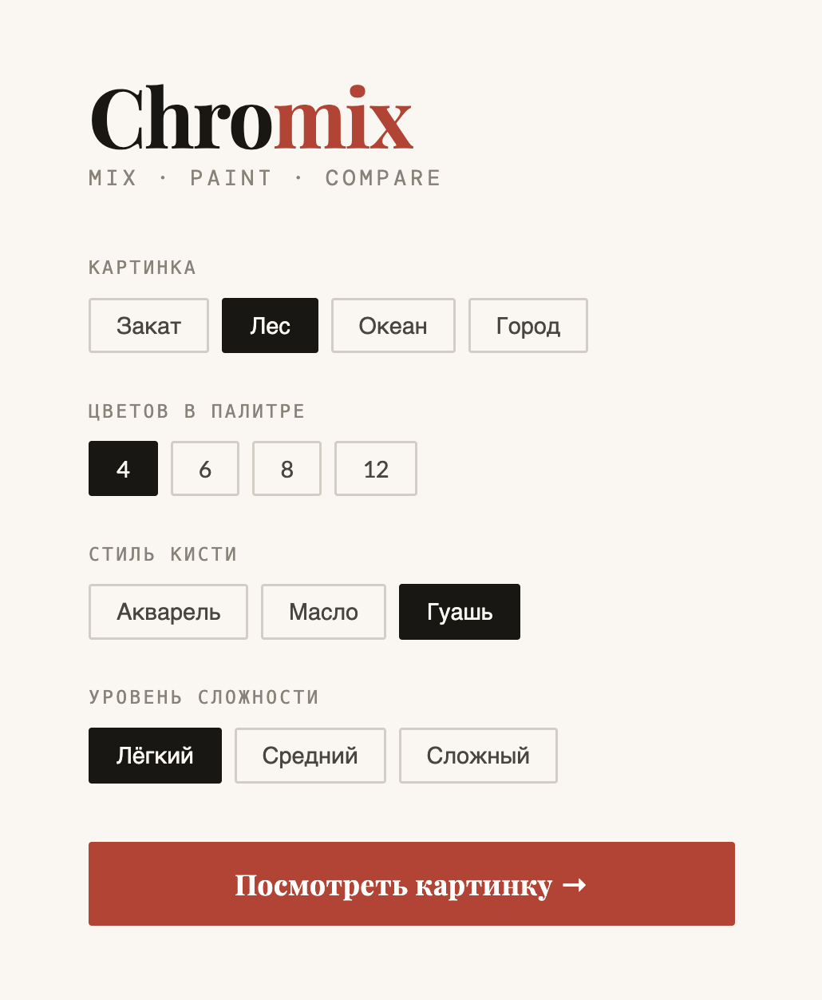

# Chromix 🎨

**Chromix** — это браузерная игра на смешивание цветов, в которой игрок пытается как можно точнее восстановить исходное изображение.

Игрок выбирает или смешивает цвета на палитре, закрашивает области на холсте и в конце получает результат: визуальное сравнение, тепловую карту точности и итоговый счёт.

## Скриншот



---

## Возможности

- запуск прямо в браузере без сервера;
- выбор изображения, размера палитры, стиля кисти и сложности;
- смешивание до 3 цветов для получения нового оттенка;
- закрашивание пикселей на холсте;
- экран завершения с оценкой точности и итоговым результатом.

---

## Как играть

1. Откройте игру в браузере.
2. Выберите изображение, размер палитры, стиль кисти и уровень сложности.
3. Выберите цвет из палитры или смешайте до 3 цветов, чтобы получить новый.
4. Кликайте по пикселям на холсте и раскрашивайте изображение.
5. Нажмите **«Завершить»**, чтобы увидеть:
   - итоговую раскраску;
   - тепловую карту точности;
   - финальный счёт.

---

## Локальный запуск

Проект не требует сборки и не использует сторонние зависимости.

Достаточно открыть файл `index.html` в любом современном браузере:

```bash
open index.html
```

---

## Структура проекта

```
chromix/
├── index.html          # Главная HTML-страница приложения
├── css/
│   └── style.css       # Все стили проекта
├── js/
│   ├── images.js       # Встроенные изображения и генерация цветов пикселей
│   ├── palette.js      # Палитра, смешивание цветов, генерация зон
│   ├── game.js         # Состояние игры, холст, логика закрашивания
│   ├── ui.js           # Интерфейс: палитра, слоты смешивания, экран результата
│   └── main.js         # Точка входа, инициализация приложения
└── assets/             # Статические ресурсы
```

---

## Технологии

* HTML
* CSS
* Vanilla JavaScript
* Canvas 2D API
* Google Fonts

Проект написан без фреймворков и внешних JS-зависимостей.

---

## Деплой

Игра развёрнута как статический сайт на Ubuntu 22.04 + Nginx.

Доступ по IP-адресу сервера:

```
http://65.21.25.175
```

Пример конфигурации Nginx

```
server {
    listen 80;
    listen [::]:80;

    server_name 65.21.25.175;

    root /var/www/chromix;
    index index.html;

    location / {
        try_files $uri $uri/ /index.html;
    }
}
```
---

# Авторы

**Михаил Кошкин**

**Максим Ерченко**

